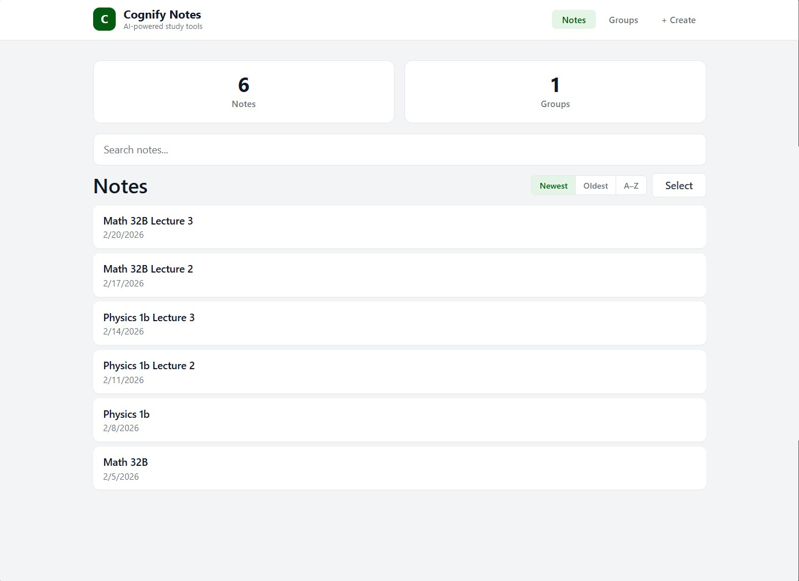
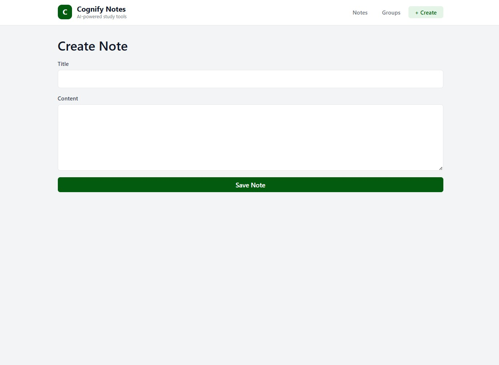
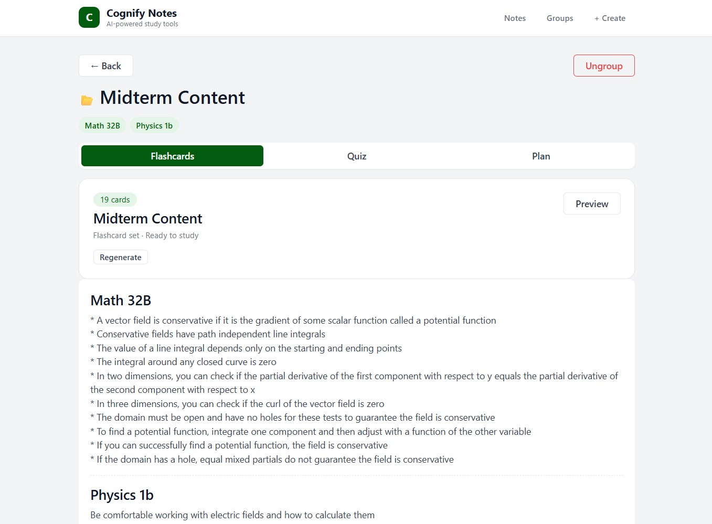
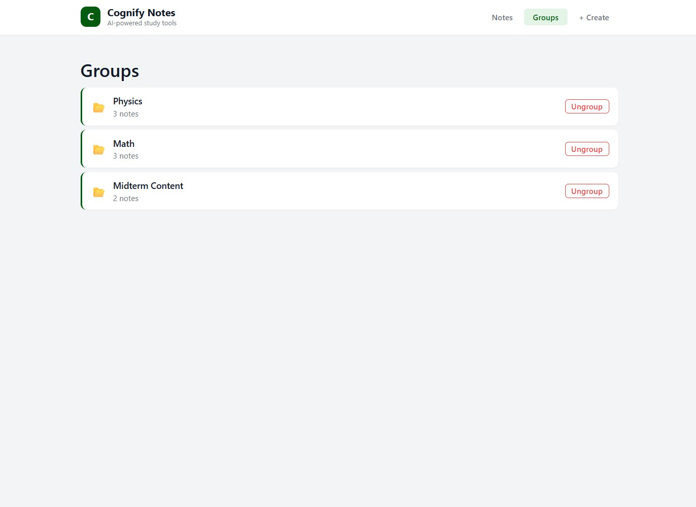
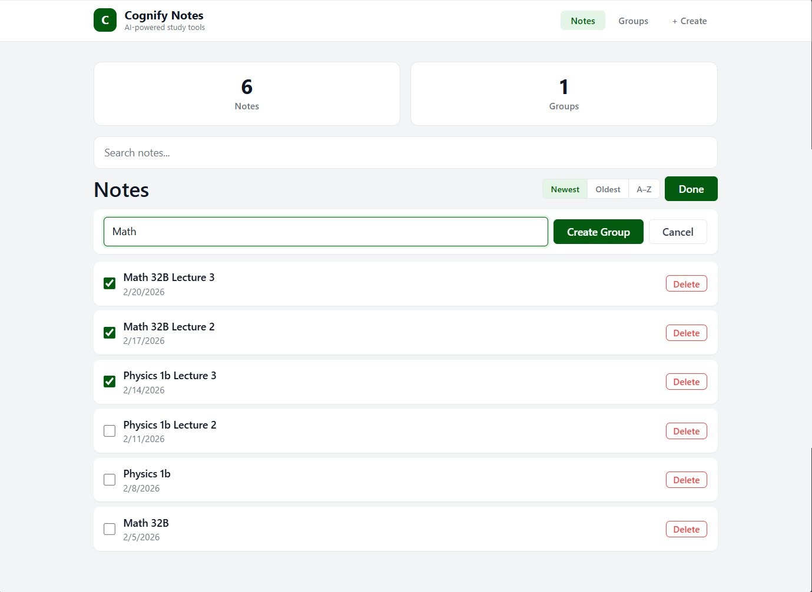
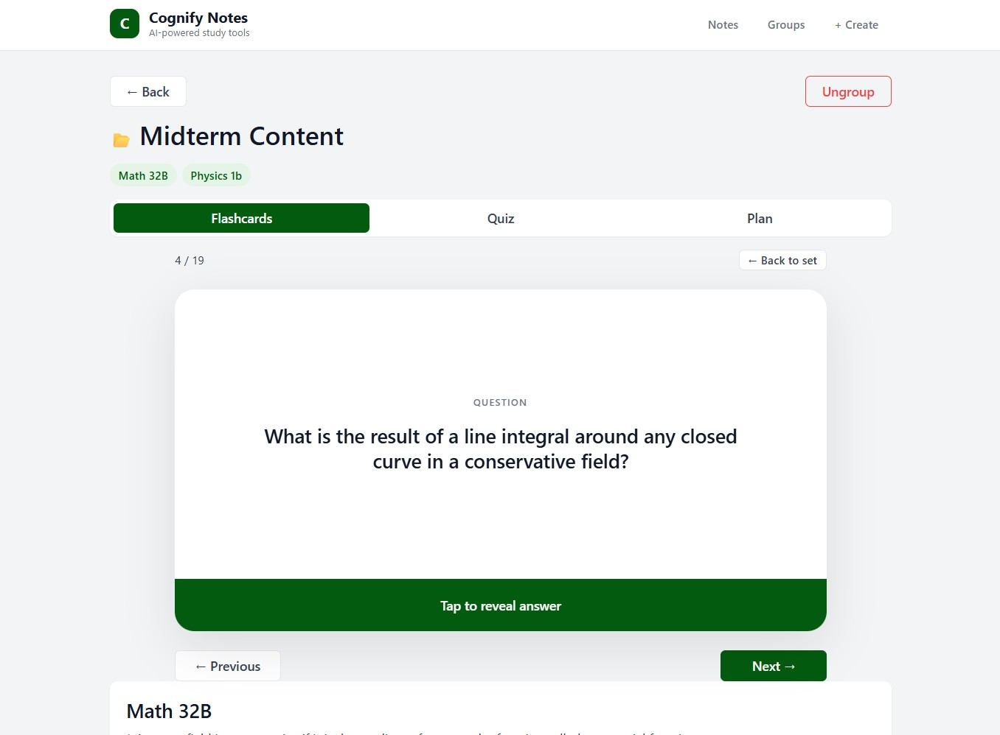
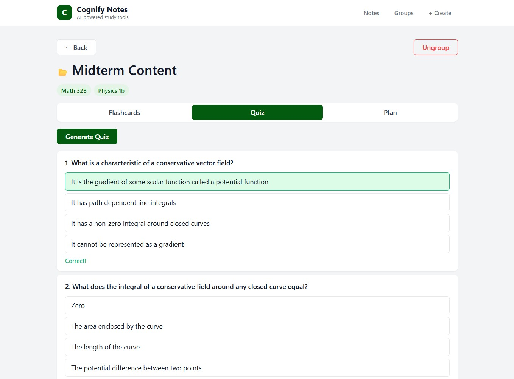
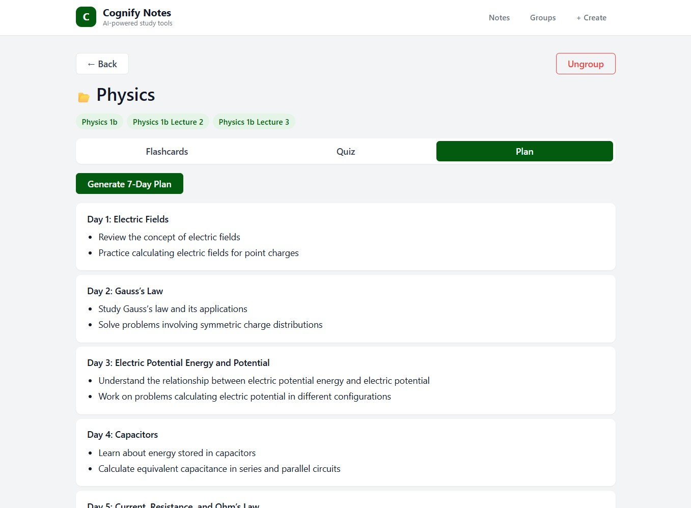

# Cognify

An AI-powered study tool that converts student notes into flashcards, quizzes, and study plans using the OpenAI API. Organize notes into groups, generate interactive study materials, and track your learning.

## Screenshots

<p align="center">
  
</p>

<p align="center">
  
</p>

<p align="center">
  
</p>

<p align="center">
  
</p>

<p align="center">
  
</p>

<p align="center">
  
</p>

<p align="center">
  
</p>

<p align="center">
  
</p>

## Tech Stack

- **Frontend** -- React (Vite), served via Nginx in production
- **Backend** -- FastAPI, SQLAlchemy ORM
- **Database** -- PostgreSQL 16
- **AI** -- OpenAI API (GPT)
- **Containerization** -- Docker & Docker Compose

## Getting Started

### Prerequisites

- [Docker Desktop](https://www.docker.com/products/docker-desktop/) installed and running
- An [OpenAI API key](https://platform.openai.com/api-keys)

### 1. Clone the repository

```bash
git clone https://github.com/your-username/Cognify.git
cd Cognify
```

### 2. Create a root `.env` file

Copy the example and fill in your OpenAI key:

```bash
cp .env.example .env
```

Then edit `.env` and set your key:

```
OPENAI_API_KEY=sk-proj-your-key-here
POSTGRES_USER=cognify
POSTGRES_PASSWORD=changeme
POSTGRES_DB=cognify
```

### 3. Start the app

```bash
docker compose up --build
```

### 4. Open in your browser

| Service | URL |
|---|---|
| Frontend | [http://localhost:3000](http://localhost:3000) |
| Backend API docs | [http://localhost:8001/docs](http://localhost:8001/docs) |
| Backend health check | [http://localhost:8001/api/health](http://localhost:8001/api/health) |

## Local Development (without Docker)

### Backend

```bash
cd backend
python -m venv .venv
.venv\Scripts\activate        # Windows
# source .venv/bin/activate   # macOS/Linux
pip install -r requirements.txt
uvicorn main:app --port 8001 --reload
```

Requires a running PostgreSQL instance and a `backend/.env` file with `DATABASE_URL` and `OPENAI_API_KEY`.

### Frontend

```bash
cd frontend
npm install
npm run dev
```

The Vite dev server runs on `http://localhost:5173` and proxies `/api` requests to `http://localhost:8001`.

## Features

- **Notes** -- Create, view, search, sort, and delete notes
- **Groups** -- Organize notes into folders/groups
- **Flashcards** -- AI-generated flashcard sets with a flip-card study view
- **Quizzes** -- Multiple-choice quizzes generated from your notes
- **Study Plans** -- AI-generated study plans tailored to your content
- **Persistence** -- All generated study materials are saved and reloaded automatically

## Project Structure

```
Cognify/
├── backend/
│   ├── main.py            # FastAPI routes and startup
│   ├── models.py          # SQLAlchemy models
│   ├── schemas.py         # Pydantic schemas
│   ├── database.py        # DB engine and session
│   ├── openai_client.py   # OpenAI API integration
│   ├── Dockerfile
│   └── requirements.txt
├── frontend/
│   ├── src/
│   │   ├── App.jsx        # Main React component
│   │   ├── App.css        # Styles
│   │   └── main.jsx       # Entry point
│   ├── Dockerfile
│   ├── nginx.conf         # Production Nginx config
│   └── package.json
├── docker-compose.yml
├── .env.example
└── README.md
```

## Stopping the App

```bash
docker compose down       # stop containers (data persists)
docker compose down -v    # stop containers and delete database volume
```
